# İhale Takip Sistemi

Sözleşmesi imzalanan ihalelerin, partiler halinde alımı esnasında  süreç takibi için kullanılabilecek Uygulama.

## Ekran Görüntüleri ve Açıklamalar

Örnek Veri tabanında kayıtlı kullanıcı bilgisi;

**Kullanıcı adı** : admin

**Şifre**: admin

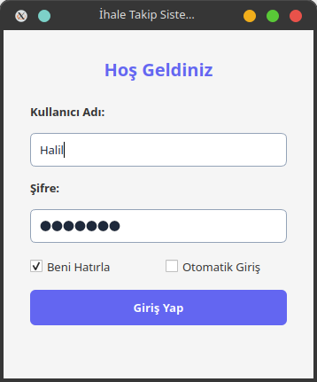

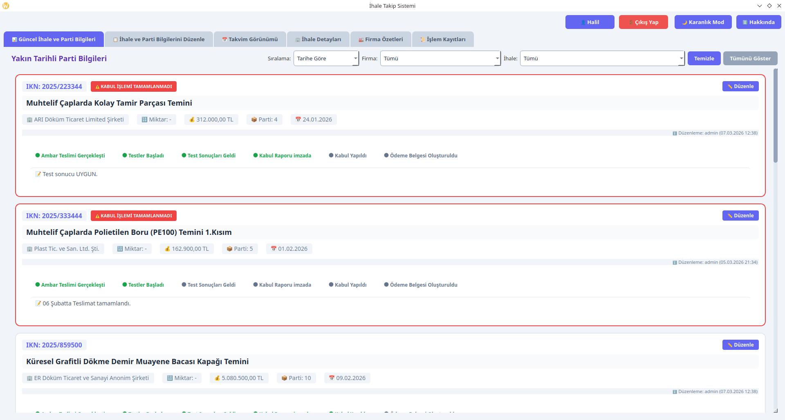
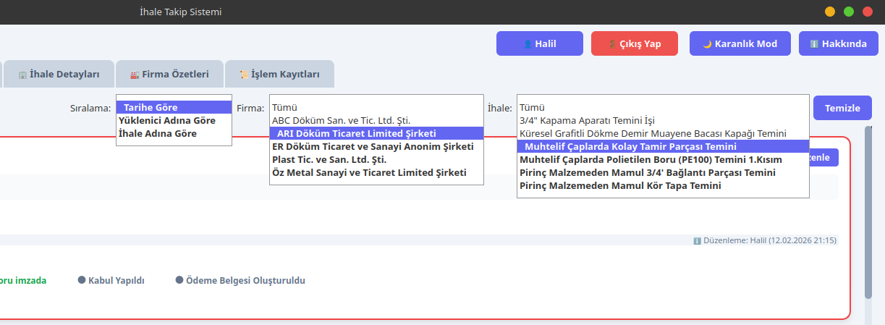

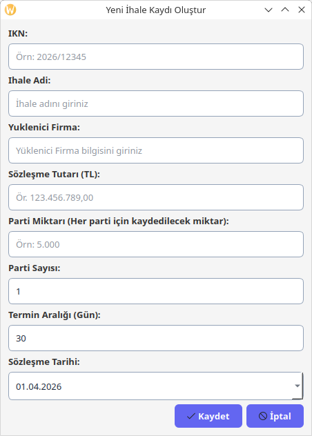
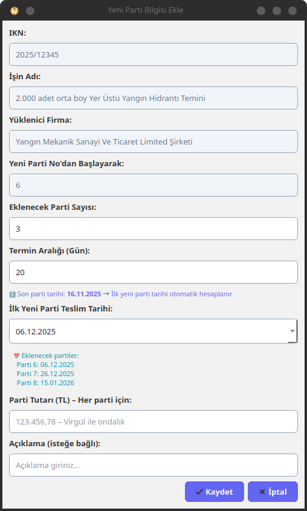
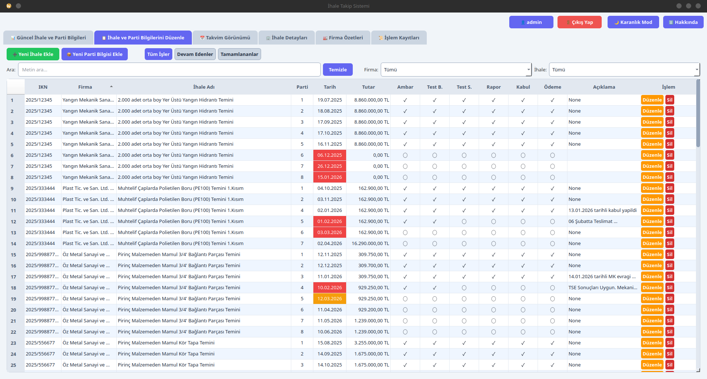
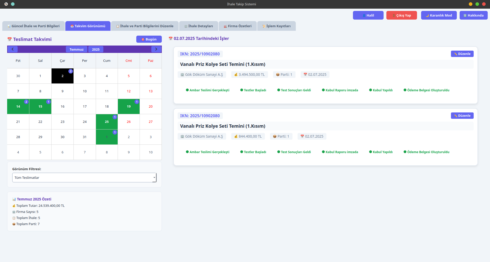
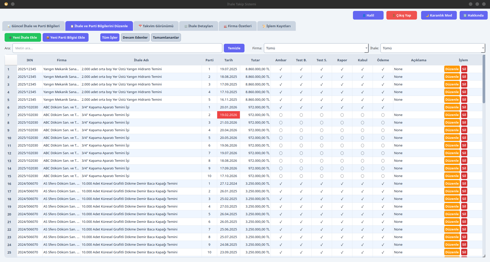

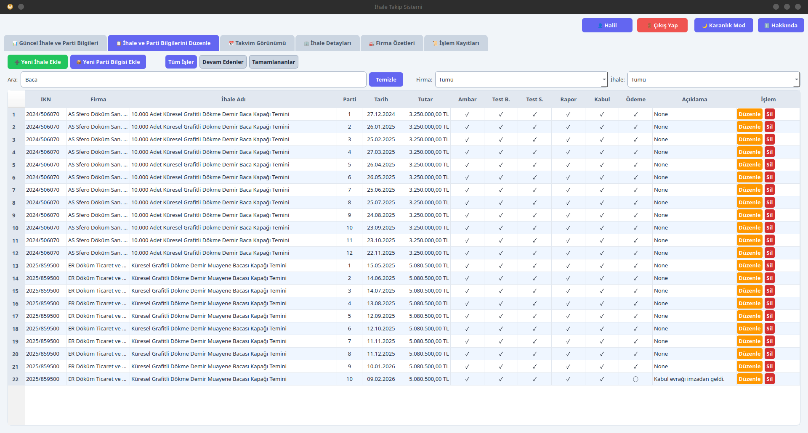

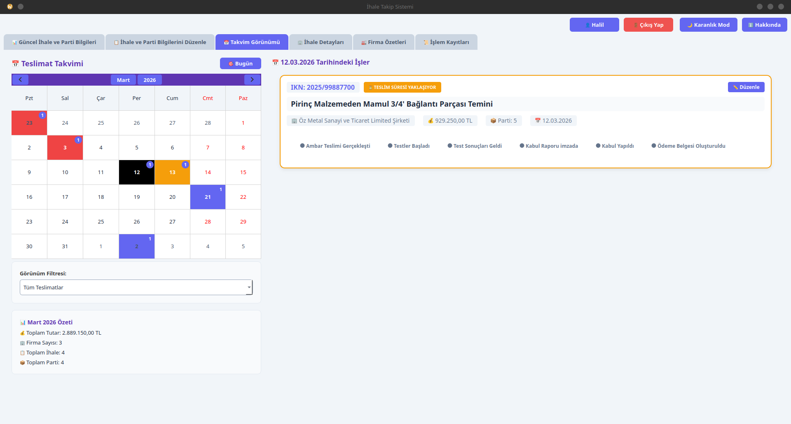
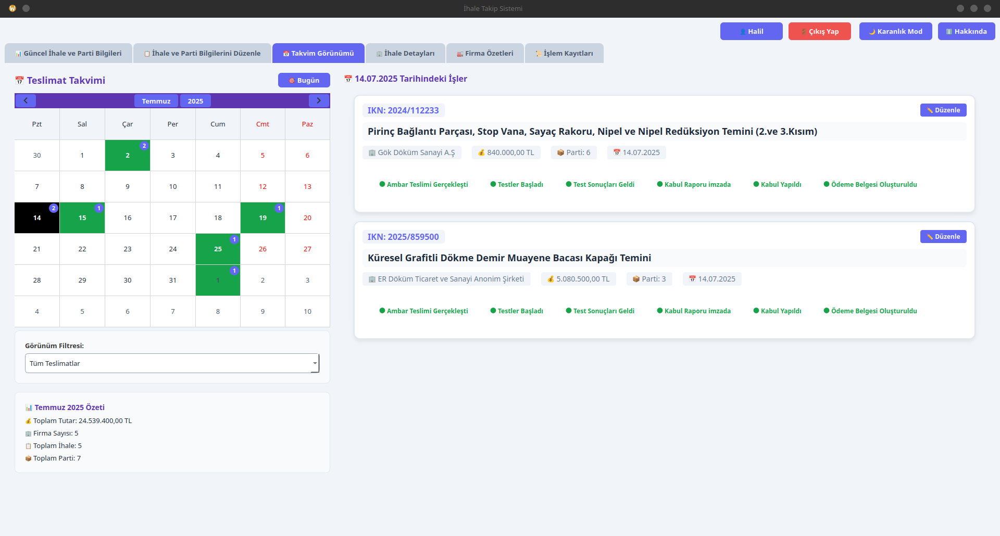
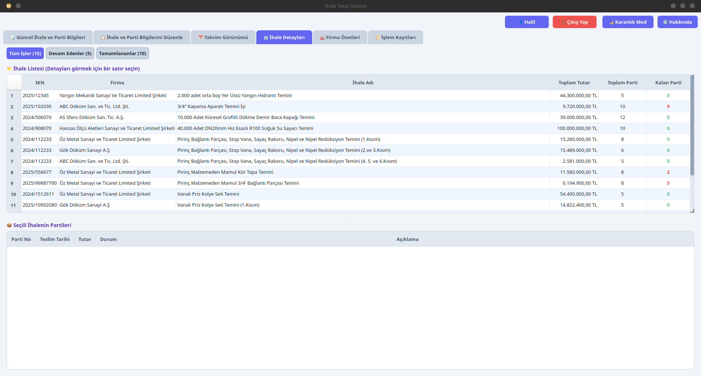
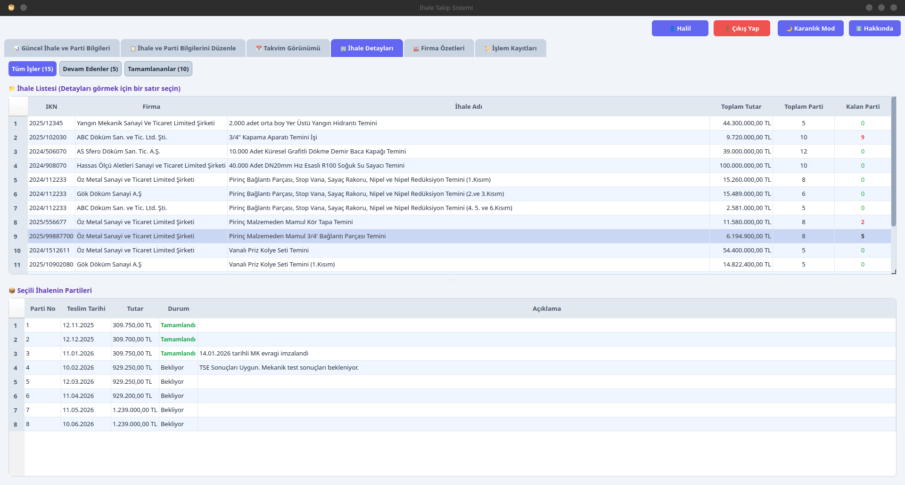
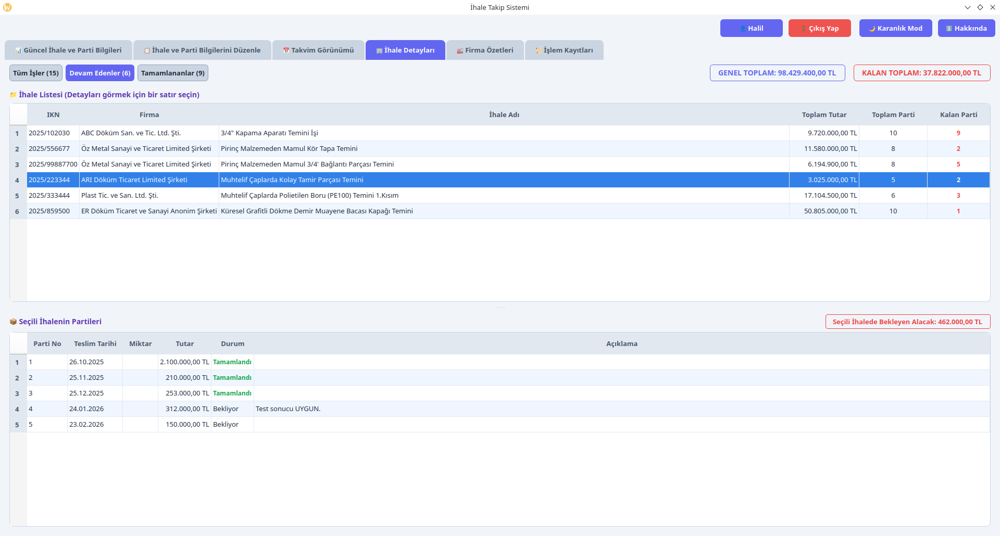
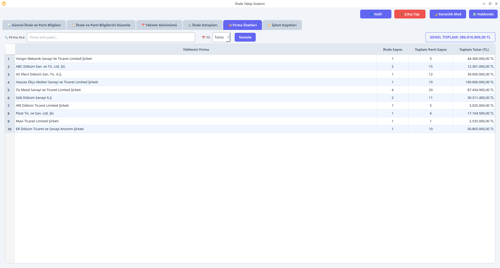
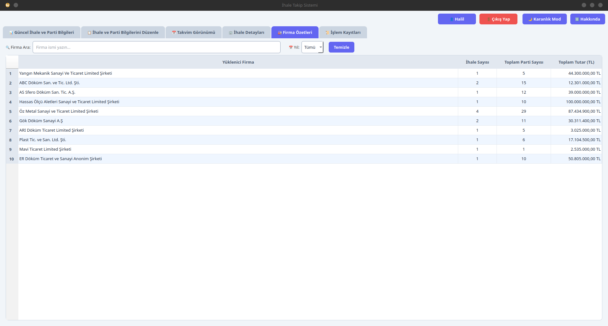
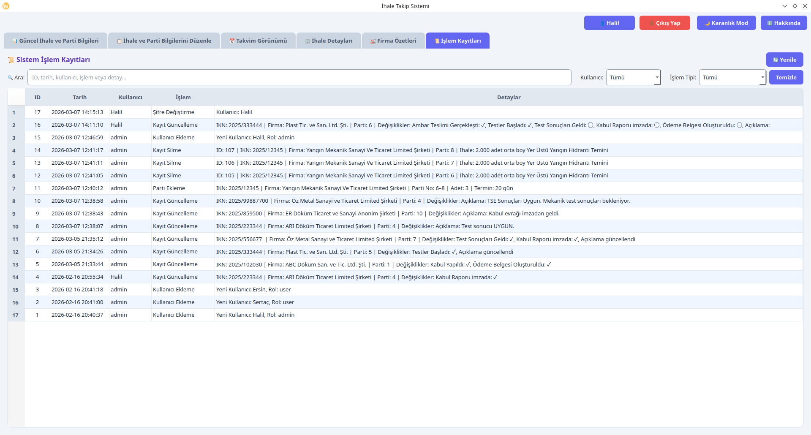

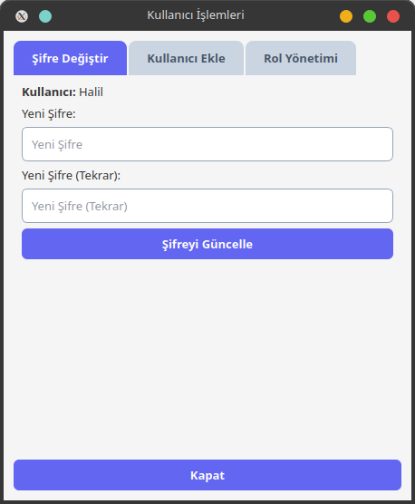
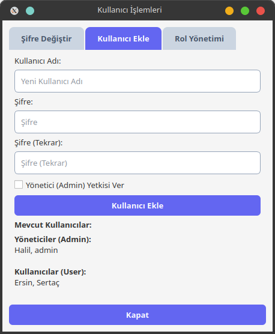
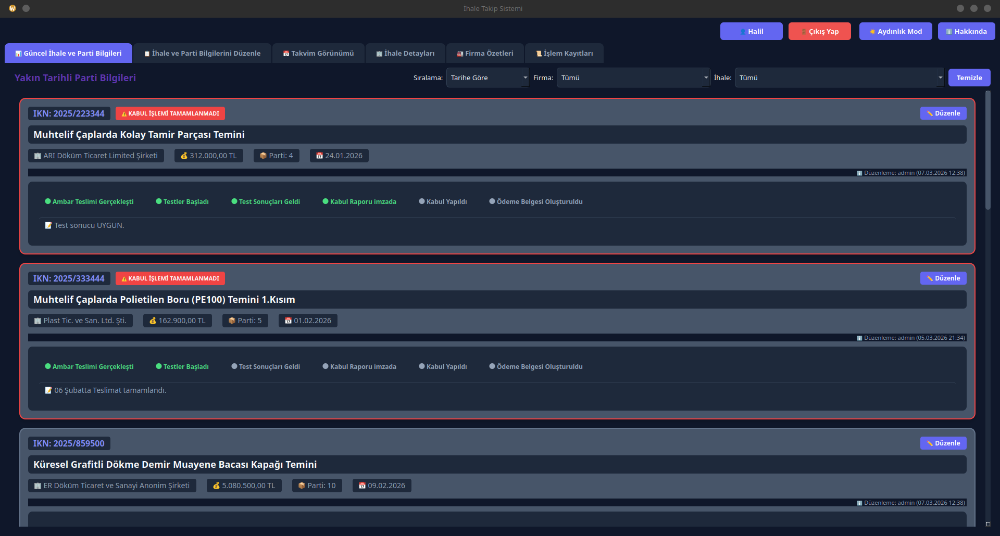

**Geliştirici Bilgileri:**

* Geliştirici: Mustafa Halil GÖRENTAŞ

**Teknik Bilgiler:**

* Platform: Google Antigravity
* Metodoloji: Vibe Coding
* Progrmalama Dili: Python 3.12.4
* Framework: PyQt6 (Riverbank Computing)
* Veri Tabanı: SQLite

GPL Lisansı Altında Dağıtılmaktadır. | 2026
