# İhale Takip Sistemi

**İhale Takip Sistemi**, şirketiniz veya kurumunuz bünyesindeki ihale süreçlerini, teslimat partilerini, test aşamalarını ve ödeme süreçlerini adım adım ve düzenli bir şekilde takip etmenizi sağlayan kapsamlı bir masaüstü uygulamasıdır. İçerisindeki modüler sekmeler, loglama ve veritabanı otomasyonları ile güvenli ve hızlı veri takibi sağlar.

## 🚀 Özellikler

- **Çoklu Kullanıcı ve Rol Yönetimi:** Bireysel kullanıcılar (user) ile tam yetkili yöneticiler (admin) oluşturabilme.
- **Otomatik Veritabanı Yedekleme:** Uygulama her açıldığında son alınan yedeği kontrol eder ve 7 tam günde bir (haftalık) otomatik yedek alarak olası veri kayıplarının önüne geçer.
- **Kapsamlı İhale ve Parti Yönetimi:** İhalelere ait sözleşme tutarı, firma bilgisi, İKN ve alt teslimat partilerini tek bir noktadan güvenle kolayca sisteme girebilirsiniz.
- **Detaylı Süreç Takibi:** Ambar teslimi, test süreçleri, muayene-kabul durumu ve ödeme belgesi oluşturma aşamalarının interaktif check-box'larla takibi.
- **Yaklaşan Teslimatlar ve Takvim:** Teslimat tarihlerini takvim üzerinden görebilme; geciken veya yaklaşan teslimatların hücre renkleriyle (Kırmızı/Turuncu) görsel olarak uyarılması.
- **Gelişmiş Raporlama ve Özetler:** Firma bazlı ve ihale bazlı verilerin yıllara göre filtrelenerek finansal ve iş hacmi olarak özetinin çıkarılması.
- **İşlem Geçmişi (Logs):** Yöneticiler için sistemde yapılan veri girişleri, şifre değişimleri, eklentiler ve silme işlemlerinin kaydedildiği log izleme ekranı.
- **Modern ve Özelleştirilebilir Arayüz:** Kullanıcı dostu ve dinamik tasarım. İstek doğrultusunda tek bir butonla menüler arasında "Karanlık Mod/Aydınlık Mod" (Dark/Light Mode) geçişleri.
- **PySide6 / PyQt6 Esnekliği:** Sisteminizde kurulu olan modern kütüphanelerden (PySide6 öncelikli olmak üzere) birini tespit ederek dinamik olarak çalışır.

## 🛠️ Kurulum ve Çalıştırma

### Gereksinimler

- Python 3.10 veya üzeri
- `PySide6` veya `PyQt6` kütüphanesi

```bash
# Gerekli kütüphaneyi yüklemek için:
pip install PySide6
# veya
pip install PyQt6
```

### Uygulamayı Başlatma

Proje dizinine komut satırında geçiş yaparak ana Python dosyasını çalıştırın:

```bash
cd "C:\Python Kod sahası\İhale Takip\"
python ihale_takip_sistemi.py
```

## 🖥️ Arayüz ve Ana Modüller

Uygulama başlatıldığında ekranın üst tarafındaki tablardan 6 ana modüle erişilebilir:

1. **📊 Güncel İhale ve Parti Bilgileri:** Devam eden, ödemesi henüz tamamlanmamış ve teslimatı beklenen tüm ihale partilerini kritik tarihlere göre listeler. En çok kullanılan ana takip ekranıdır.
2. **📋 İhale ve Parti Bilgilerini Düzenle:** Yeni bir parti/ihale girişi yapılan, silinen, ve her partinin süreç duraklarının detaylıca düzenlendiği sekme.
3. **📅 Takvim Görünümü:** Tüm partilerin teslim tarihlerini geniş bir takvim paneli üzerinde görmenizi sağlar.
4. **🏢 İhale Detayları:** Ayrı partileri ihaleler ve İKN çerçevesinde birleştirerek sözleşme bütününde okumanıza olanak tanır.
5. **🏭 Firma Özetleri:** Yıllık performansa bağlı olarak hangi alt yüklenici firmanın toplamda kaç iş aldığını ve finansal hacimlerini hesaplar.
6. **📜 İşlem Kayıtları:** (Sisteme sadece "Admin" rolündeki kullanıcılar ile giriş yapıldığında görünür.) Uygulama içindeki hareketleri log tablosundan yansıtır.

## 🔐 Kullanıcı Girişi ve Yetkilendirme

- Uygulama ilk kez çalıştırıldığında veriler içerisinde varsayılan olarak **admin** (Şifre: **admin**) hesabı oluşturulur. 
- Giriş yaptıktan sonra sağ üstteki "Kullanıcı" butonuna tıklayarak profil şifrenizi değiştirebilirsiniz. 
- Sadece `admin` yetkisine sahip hesaplar "Yeni Kullanıcı" ekleyebilir ve diğer personellerin rollerini değiştirebilir. 
- Hesaptan tek bir butonla çıkabilir, aynı bilgisayarı başkalarıyla kullanırken verilerinizin güvenliğini sağlayabilirsiniz.

## 🗄️ Veritabanı Yedekleme Sistemi (Otomasyon)

Sistemin verileri yerel bir SQLite veritabanı dosyasında (`veriler.db`) güvenli şekilde barındırılır. 
Kodun ana çalışmasına entegre ettiğimiz `check_and_create_backup()` fonksiyonu sayesinde:

- Sistem kök dizininde otomatik bir `Yedekler` klasörü oluşturulur.
- Hafta dönüşlerinde (Son yedeğin üzerinden 7 gün tamamlandığında) tüm veriler o saniyenin timestamp ismiyle dondurulup kopyalanır (`veriler_yedek_YYYY-MM-DD_HH-MM-SS.db`). Manuel işlem veya onay gerektirmez.

## Ekran Görüntüleri ve Açıklamalar

Örnek Veri tabanında kayıtlı kullanıcı bilgisi;

**Kullanıcı adı** : admin

**Şifre**: admin

Giriş Ekranındaki "Beni Hatırla" ve "Otomatik Giriş" kutucuklarını işaretlerseniz, Uygulama içerisindeki "Çıkış" Butonuna basmadığınız sürece, uygulamayı çalıştırdığınızda kullanıcı adı ve şifre sormadan uygulama direkt açılır. 

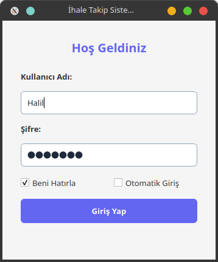

**Güncel İhale ve Parti Bilgileri** Sekmesinde, devam eden henüz **Ödeme Belgesi Oluşturuldu** seçeneği işaretlenmeyen her işe ait son 2 parti bilgisi görüntülenir.

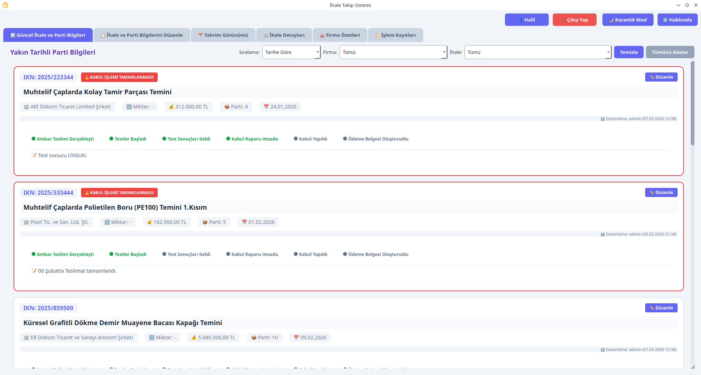

**Güncel İhale ve Parti Bilgileri** Sekmesinde varsayılan olarak "Parti Son Teslim Tarihi"ne göre sırala yapılır. İsterseniz sıralamayı değiştirebilir ya da Firma / İhale adına göre filtre de uygulayabilirsiniz. 

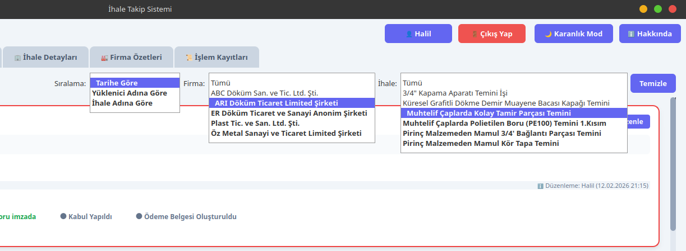

**İhale ve Parti Bilgilerini Düzenle** sekmesinde, Veri tabanında kayıtlı tüm bilgileri görüntüleyerek düzenleyebilirsiniz. 


"**+ Yeni İhale Ekle**" butonuna basarak "**Yeni İhale Kaydı Oluştur**" penceresine ulaşabilir.  Gerekli bilgileri girerek yeni ihale bilgilerini veri tabanına ekleyebilirsiniz.

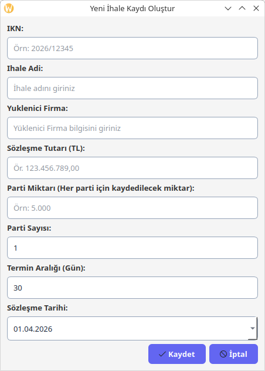

**İhale ve Parti Bilgilerini Düzenle** sekmesinde bir ihale seçildikten sonra **Yeni Parti Bilgisi Ekle** butonuna tıklayarak ilave parti bilgilerini ekleyebilirsiniz. Seçili ihaleye ait IKN, İşin Adı, Yüklenici Firma Bilgileri otomatik olarak gelecek ve kayıtlı son partinin üzerine parti sayısı/sayıları ekleyecektir. **Eklenecek Parti Sayısı**, **Termin Aralığı (Gün)** ve **Parti Tutarı Her Parti için** bilgilerini belirtmeniz yeterli. Eklenecek parti bilgileri aşağıda önizlenecektir.

Bu seçenek, yanlış girilmiş verileri düzeltmek için kullanılacağı gibi, iş artışı sonrası ilave bilgileri girmek için de kullanılabilir.

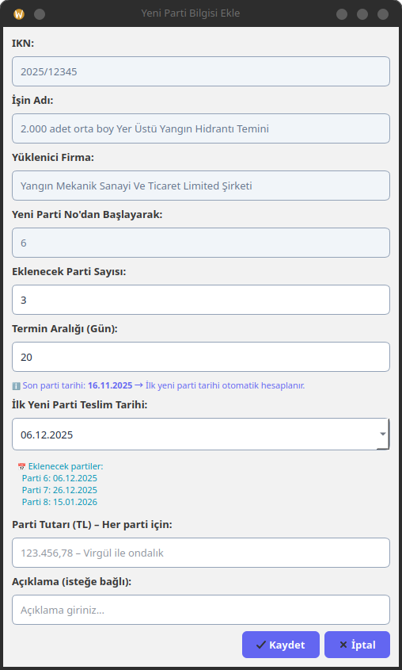

Aşağıda, Yeni Parti Bilgisi Ekleme sonrası (6, 7 ve 8. satırlardaki) ihaleye ait güncel görüntü mevcuttur.  

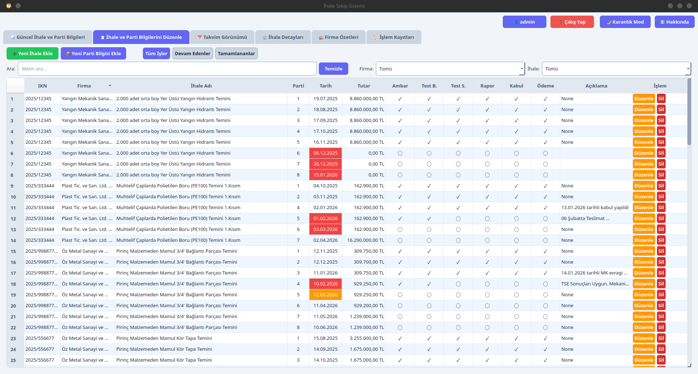
**İhale ve Parti Bilgilerini Düzenle** sekmesinde bulunan **Düzenle** butonuna basarak mevcut bilgiler düzenlenebilir / güncellenebilir. Değişiklikler kaydedildiğinde, değişikliği yapan kullanıcı ve tarih/zaman bilgisi eklenir.

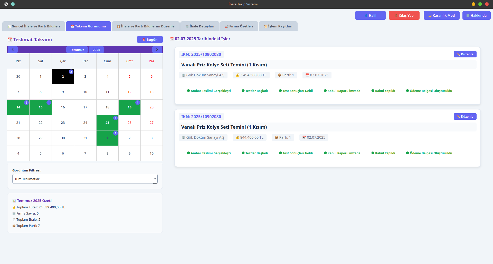

**İhale ve Parti Bilgilerini Düzenle** sekmesinde de, Arama ve Filtreleme seçenekleri mevcut.

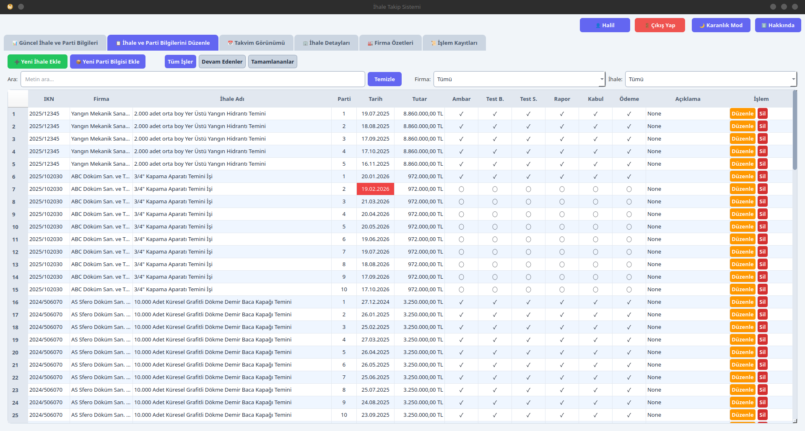

Ayrıca **DevamEden İşler** butonuna basarak, sadece devam eden işleri filtrelemek te mümkün.

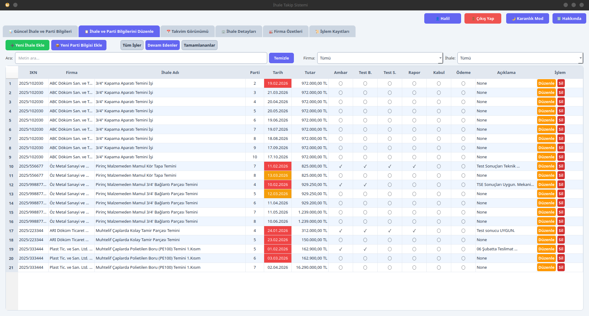

Arama çubuğuna yazılan içerikle, İhale adı, Yüklenici firma adı, IKN, ...vb bilgilere  kolaylıkla ulaşılabilir.


**İhale ve Parti Bilgilerini Düzenle** sekmesindeki **Sil** butonu yardımıyla, **Sadece seçili parti bilgisini** ya da **Seçili İhaleye ait tüm bilgileri** silmek mümkün.

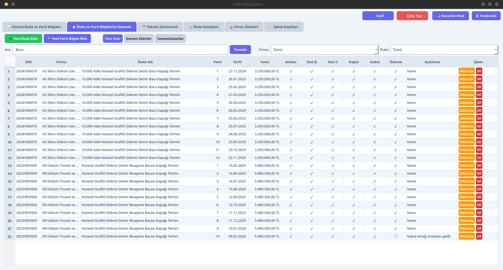

**Takvim Görünümü** Sekmesinde aylık İhale ve parti bilgileri görüntülenir.

* Siyah Renk: Bugünü ve Takvim üzerinde yapılan seçimi,

* Kırmızı Renk: Henüz Ödemesi Yapılmamış parti bilgilerini,

* Sarı Renk: Teslim süresi yapkalan parti bilgilerini,

* Mavi Renk: Son teslim tarihi yaklaşmayan parti bilgilerini,

* Yeşil Renk: İşlemleri tamamlanmış ve Ödemesi Gerçekleşmiş parti bilgilerini

temsil eder.

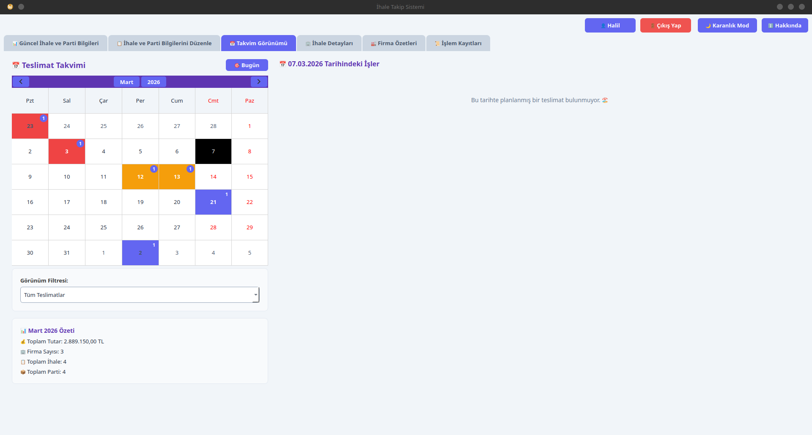

Takvim üzerinde bir güne tıklandığında, seçim **siyah** renge döner ve o gün son teslim tarihi bulunan ihale detayları görüntülenir.

Takvimin alt kısmında **Aylık Toplam Tutar, Firma sayısı, Toplam İhale ve Parti bilgileri** görüntülenir. 

**Görünüm Filtresi** ile;

* Tüm Teslimatlar,

* Sadece Bekleyen,

* Sadece Tamamlanan

parti bilgileri seçilebilir.


Takvimde geriye / geçmiş aylara ya da ileriye / gelecek aylara gidilerek ihale bilgileri görüntülenebilir. **🎯 Bugün**  butonuna tıklayarak mevcut güne dönebilirsiniz. Takvim günü üzerindeki (sağ üstte) rakamlar, o gün toplam kaç adet parti bilgisini ifade eder.

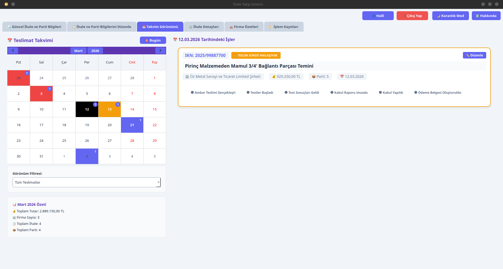

**İhale Detayları** Sekmesinde İhalelere ait detaylı bilgiler mevcut. Bu Sekmede;

* IKN,

* Firma Adı,

* İhale Adı,

* Toplam Sözleşme (İhale) Tutarı,

* İhaleye ait Toplam Parti Sayısı,

* Kabulü, Ödemesi yapılmamış Toplam (Kalan) Parti Sayısı

bilgileri görüntülenir.


Yukarıdaki İhale listesinden seçim yapılırsa, seçime ait Parti detayları aşağıdaki tabloda görüntülenir.

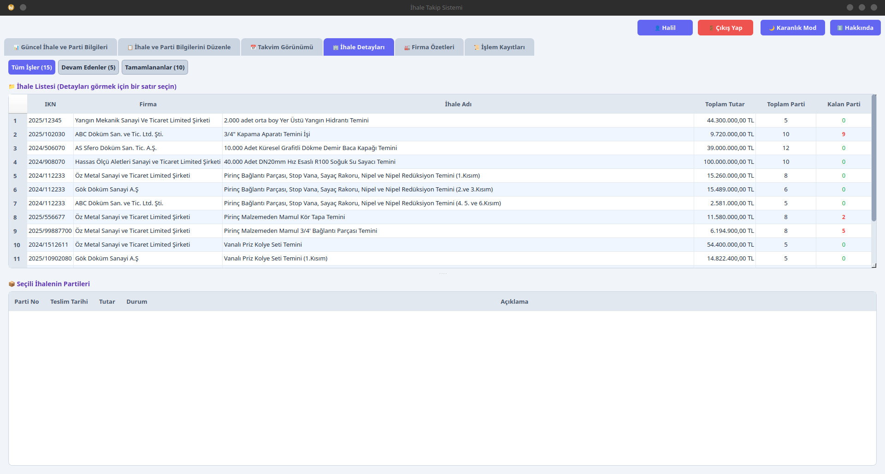

İstenirse, **Devam Edenler** Butonuna tıklanarak sadece mevcut devam eden işlere ait bilgiler filtrelenebilir. Buton üzerinde, Güncel devam eden ihale sayısı görüntülenir. 

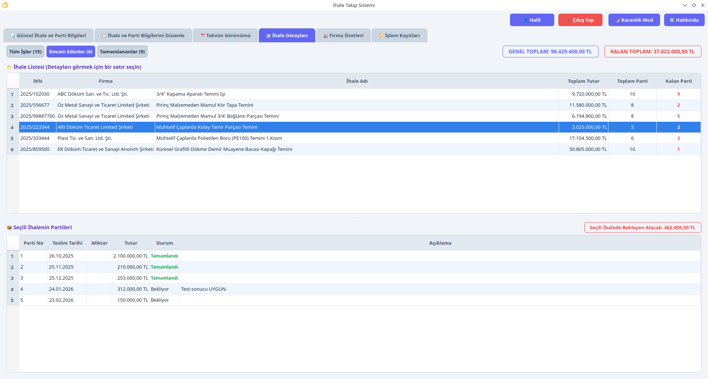

**Firma Özetleri** Sekmesinde, Firmaların toplam kaç adet ihale aldığı / sözleşme imzaladığı, bunların toplam tutarları ve parti sayıları da görüntülenir.

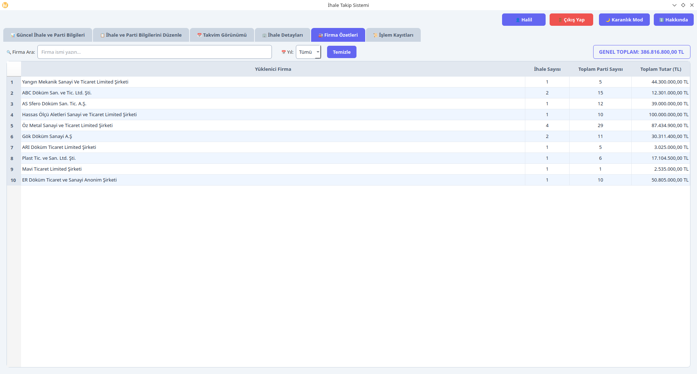

**Yıl** menüsünden seçim yapılarak o yıla ait Firma, İhale sayısı, parti sayısı ve Tutarlarını görebiliriz.

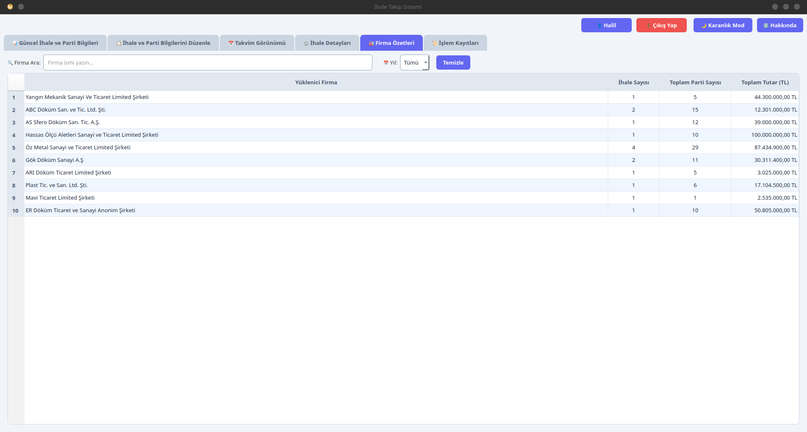

**İşlem Kayıtları** sekmesinde, kullanıcılar tarafından yapılan tüm iş kalemlerinin detaylarını görebiliriz. Bu Sekme yalnız Admin yetkisi olan kullanıcılara açıktır.

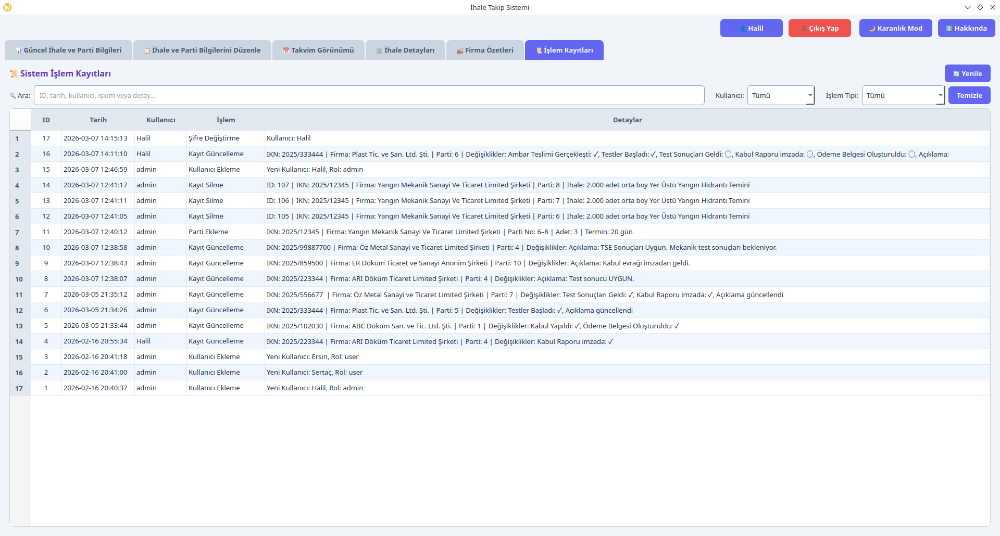

Admin yetkisi olan kullanıcılar, Sağ üstetki kullanıcı adı butonuna tıklayarak **Kullanıcı İşlemleri Penceresi**ni açarak;

* Şifre değişikliği,

* Kullanıcı Ekleme,

* Kullanıcı ve gruplarını görüntüleme,

* Kullanıcı Yetkisi (Rol) değiştirme,

işlemleri yapabilir.

Standart kullanıcı sadece kendi şifresini değiştirebilir.

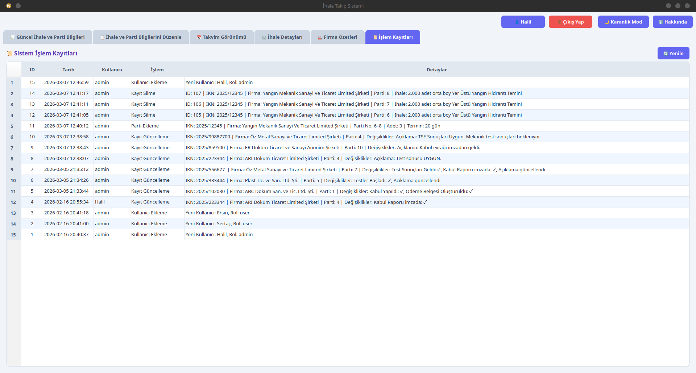

Kulalnıcı ekle, Mevcut Kullanıcı adı ve gruplarını görüntüle;

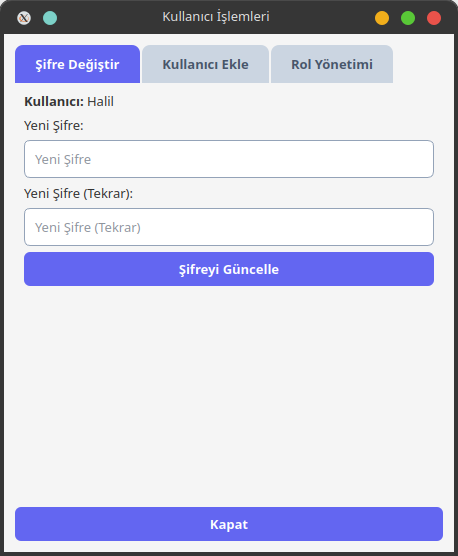

Kullanıcı Rolünü (yetkisini) Değiştir

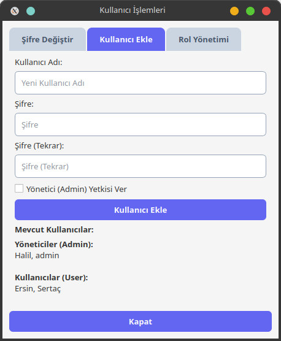

Uygulamada **Karanlık Mod** Özelliği de mevcut.

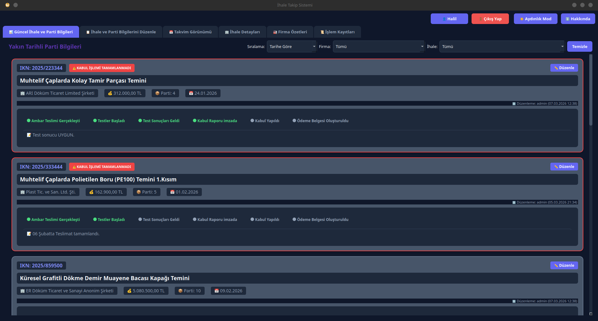

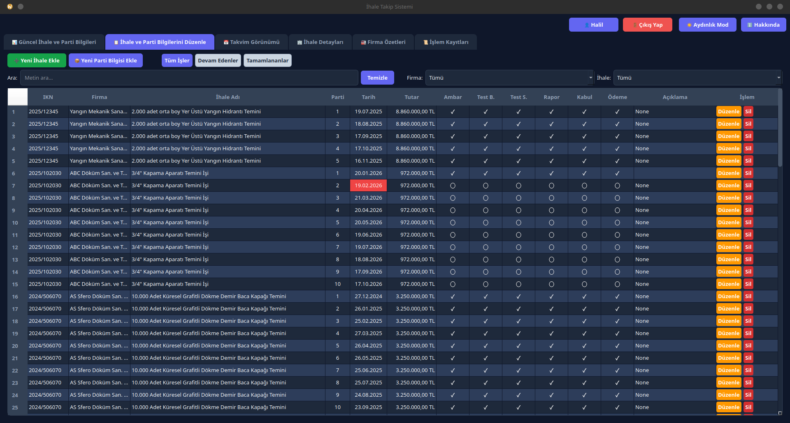

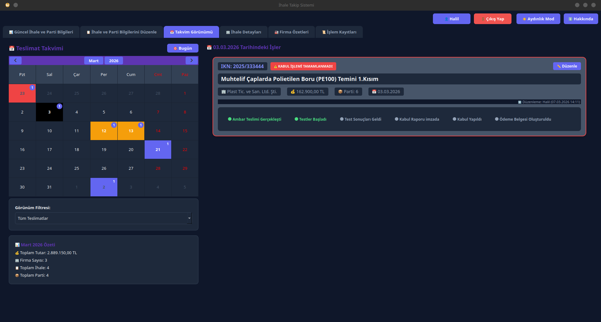

Hakkında Penceresi;

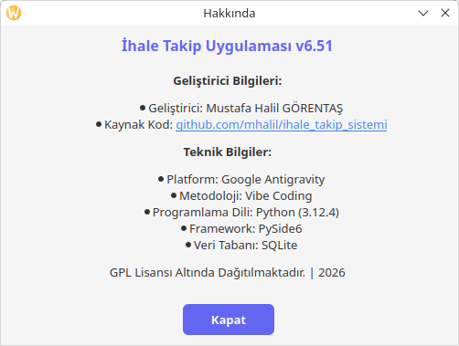

## 👨‍💻 Geliştirici ve Destek

- **Geliştirici:** Mustafa Halil GÖRENTAŞ
- **Kaynak Kod / İletişim:** [GitHub - mhalil](https://github.com/mhalil/ihale_takip_sistemi)
- **Lisans:** GPL (Genel Kamu Lisansı)
  *Bu yazılım Google DeepMind platformundaki gelişmiş Agent'ler ile (Antigravity) vibecoding mantığıyla desteklenerek oluşturulmuştur.*

**Teknik Bilgiler:**

* Platform: Google Antigravity
* Metodoloji: Vibe Coding
* Progrmalama Dili: Python 3.12.4
* Framework: PyQt6 (Riverbank Computing)
* Veri Tabanı: SQLite

GPL Lisansı Altında Dağıtılmaktadır. | 2026
