# İhale (Sözleşme) Takip Sistemi

**İhale (Sözleşme) Takip Sistemi**, şirketiniz veya kurumunuz bünyesindeki ihale süreçlerini, teslimat partilerini, test aşamalarını ve ödeme süreçlerini adım adım ve düzenli bir şekilde takip etmenizi sağlayan kapsamlı bir masaüstü uygulamasıdır. İçerisindeki modüler sekmeler, loglama ve veritabanı otomasyonları ile güvenli ve hızlı veri takibi sağlar.

## 🚀 Özellikler

- **Çoklu Kullanıcı ve Rol Yönetimi:** Bireysel kullanıcılar (user) ile tam yetkili yöneticiler (admin) oluşturabilme.
- **Otomatik Veritabanı Yedekleme:** Uygulama her açıldığında son alınan yedeği kontrol eder ve 7 tam günde bir (haftalık) otomatik yedek alarak olası veri kayıplarının önüne geçer.
- **Kapsamlı İhale ve Parti Yönetimi:** İhalelere ait sözleşme tutarı, firma bilgisi, İKN ve alt teslimat partilerini tek bir noktadan güvenle kolayca sisteme girebilirsiniz. 
- **Detaylı Süreç Takibi:** Ambar teslimi, test süreçleri, muayene-kabul durumu ve ödeme belgesi oluşturma aşamalarının interaktif check-box'larla takibi.
- **Yaklaşan Teslimatlar ve Takvim:** Teslimat tarihlerini takvim üzerinden görebilme; geciken veya yaklaşan teslimatların hücre renkleriyle (Kırmızı/Turuncu) görsel olarak uyarılması.
- **Gelişmiş Raporlama ve Özetler:** Firma bazlı ve ihale bazlı verilerin yıllara göre filtrelenerek finansal ve iş hacmi olarak özetinin çıkarılması.
- **İşlem Geçmişi (Logs):** Yöneticiler için sistemde yapılan veri girişleri, şifre değişimleri, eklentiler ve silme işlemlerinin kaydedildiği log izleme ekranı.
- **Modern ve Özelleştirilebilir Arayüz:** Kullanıcı dostu ve dinamik tasarım. 
- **PySide6 / PyQt6 Esnekliği:** Sisteminizde kurulu olan modern kütüphanelerden (PySide6 öncelikli olmak üzere) birini tespit ederek dinamik olarak çalışır.
- **CSV Formatında Veri Dışa Aktarma Özelliği**
- **Toplu Düzenleme, Silme ve Parti Tarihi Öteleme İşlemleri**

## 🛠️ Kurulum ve Çalıştırma

### Gereksinimler

- Python 3.10 veya üzeri
- `PySide6` veya `PyQt6` kütüphanesi

```bash
# Gerekli kütüphaneyi yüklemek için:
pip install PySide6
# veya
pip install PyQt6
```

### Uygulamayı Başlatma

Proje dizinine komut satırında geçiş yaparak ana Python dosyasını çalıştırın:

```bash
cd "C:\Python Kod sahası\İhale Takip\"
python ihale_takip_sistemi.py
```

## 🖥️ Arayüz ve Ana Modüller

Uygulama başlatıldığında ekranın üst tarafındaki tablardan 6 ana modüle erişilebilir:

1. **📊 Güncel İhale ve Parti Bilgileri:** Devam eden, ödemesi henüz tamamlanmamış ve teslimatı beklenen tüm ihale partilerini kritik tarihlere göre listeler. En çok kullanılan ana takip ekranıdır.
2. **📋 İhale ve Parti Bilgilerini Düzenle:** Yeni bir parti/ihale girişi yapılan, silinen, ve her partinin süreç duraklarının detaylıca düzenlendiği sekme.
3. **📅 Takvim Görünümü:** Tüm partilerin teslim tarihlerini geniş bir takvim paneli üzerinde görmenizi sağlar.
4. **🏢 İhale Detayları:** Ayrı partileri ihaleler ve İKN çerçevesinde birleştirerek sözleşme bütününde okumanıza olanak tanır.
5. **🏭 Firma Özetleri:** Yıllık performansa bağlı olarak hangi alt yüklenici firmanın toplamda kaç iş aldığını ve finansal hacimlerini hesaplar.
6. **📜 İşlem Kayıtları:** (Sisteme sadece "Admin" rolündeki kullanıcılar ile giriş yapıldığında görünür.) Uygulama içindeki hareketleri log tablosundan yansıtır.

## 🔐 Kullanıcı Girişi ve Yetkilendirme

- Uygulama ilk kez çalıştırıldığında veriler içerisinde varsayılan olarak **admin** (Şifre: **admin**) hesabı oluşturulur. 
- Giriş yaptıktan sonra sağ üstteki "KullanıcıAdı" butonuna tıklayarak profil şifrenizi değiştirebilirsiniz. 
- Sadece `admin` yetkisine sahip hesaplar "Yeni Kullanıcı" ekleyebilir ve diğer personellerin rollerini değiştirebilir. 
- Hesaptan tek bir butonla çıkabilir, aynı bilgisayarı başkalarıyla kullanırken verilerinizin güvenliğini sağlayabilirsiniz.

## 🗄️ Veritabanı Yedekleme Sistemi (Otomasyon)

Sistemin verileri yerel bir SQLite veritabanı dosyasında (`veriler.db`) güvenli şekilde barındırılır. 
Kodun ana çalışmasına entegre ettiğimiz `check_and_create_backup()` fonksiyonu sayesinde:

- Sistem kök dizininde otomatik bir `Yedekler` klasörü oluşturulur.
- Hafta dönüşlerinde (Son yedeğin üzerinden 7 gün tamamlandığında) tüm veriler o saniyenin timestamp ismiyle dondurulup kopyalanır (`veriler_yedek_YYYY-MM-DD_HH-MM-SS.db`). Manuel işlem veya onay gerektirmez.

## Ekran Görüntüleri ve Açıklamalar

Örnek Veri tabanında kayıtlı kullanıcı bilgisi;

**Kullanıcı adı** : admin

**Şifre**: admin

Giriş Ekranındaki "Beni Hatırla" ve "Otomatik Giriş" kutucuklarını işaretlerseniz, Uygulama içerisindeki "Çıkış" Butonuna basmadığınız sürece, uygulamayı çalıştırdığınızda kullanıcı adı ve şifre sormadan uygulama direkt açılır. 

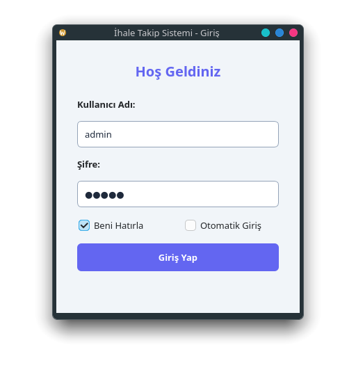
### 1. Güncel İhale ve Parti Bilgileri Sayfası

**Güncel İhale ve Parti Bilgileri** Sekmesinde, devam eden henüz **Ödeme Belgesi Oluşturuldu** seçeneği işaretlenmeyen her işe ait son 2 parti bilgisi görüntülenir.

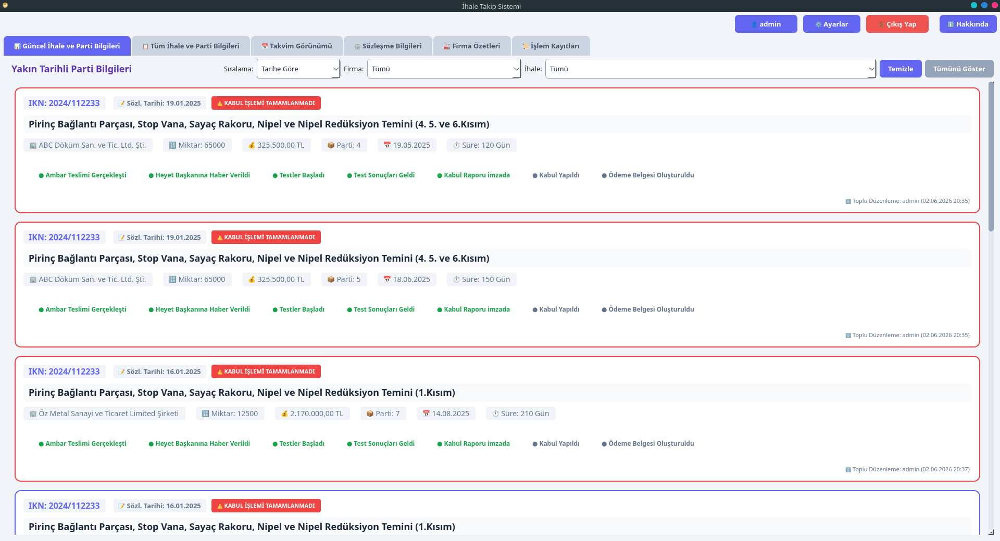

**Güncel İhale ve Parti Bilgileri** Sekmesinde varsayılan olarak "Parti Son Teslim Tarihi"ne göre sırala yapılır. İsterseniz sıralamayı değiştirebilir ya da Firma / İhale adına göre filtre de uygulayabilirsiniz. 

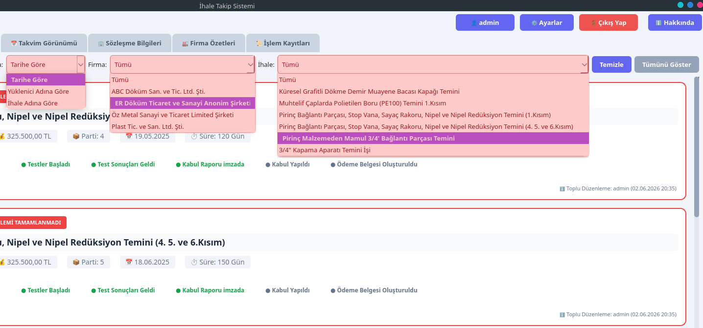

**Tüm İhale ve Parti Bilgileri** Sekmesi, Tüm kayıtların görüntülendiği, filtrelendiği, düzenlendiği ve silindiği ana yönetim ekranıdır. Her satırda işlem adımları için checkbox'lar, Düzenle/Sil butonları ve sağ tık menü seçenekleri bulunur.

**Güncel İhale ve Parti Bilgileri** Sekmesindendeki Bilgi Kartlarına sağ tıklama ve çift tıklama sonrası farklı diyalog pencereleri açılır. Aşağıda detayları görebilirsini;

* "**Kayıt Düzenle**" Penceresini açmak için mavi alana (Bilgi kartının üst yarısına) çift tıklayın.
* "**Hızlı Durum Güncelle**" Penceresini açmak için yeşil alana (Bilgi kartının alt yarısına) çift tıklayın.
* "**Toplu Kayıt Düzenle**" Penceresini açmak için Bilgi kartına sağ tıklayın.

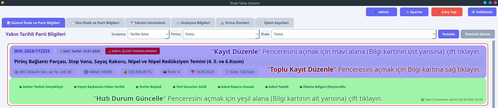

#### Hızlı Durum Güncelle Penceresi

"**Hızlı Durum Güncelle**" Penceresi;
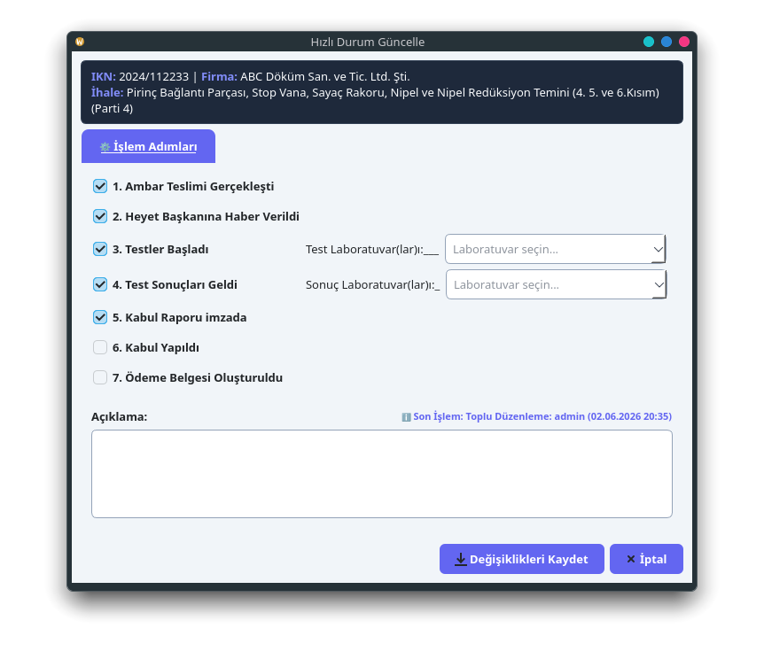
#### Kayıt Düzenle Penceresi

**Kayıt Düzenle** penceresi, **Penceresi Temel Bilgiler** Sekmesi;

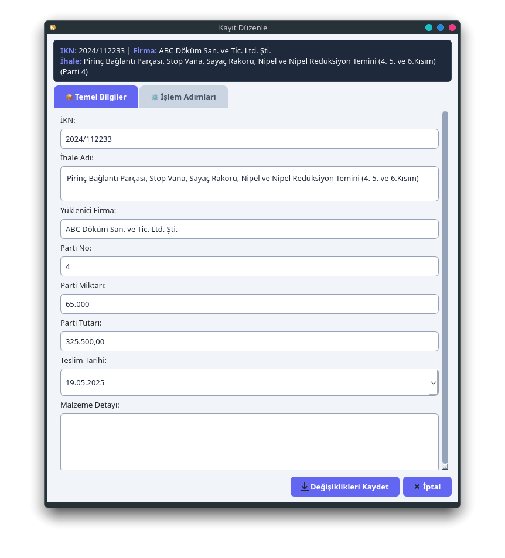

**Kayıt Düzenle** penceresi **"İşlem Adımları** Sekmesi;

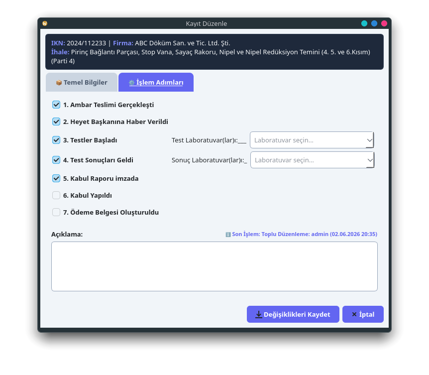
#### Toplu Kayıt Düzenle Penceresi

**Toplu Kayıt Düzenle** Penceresi;

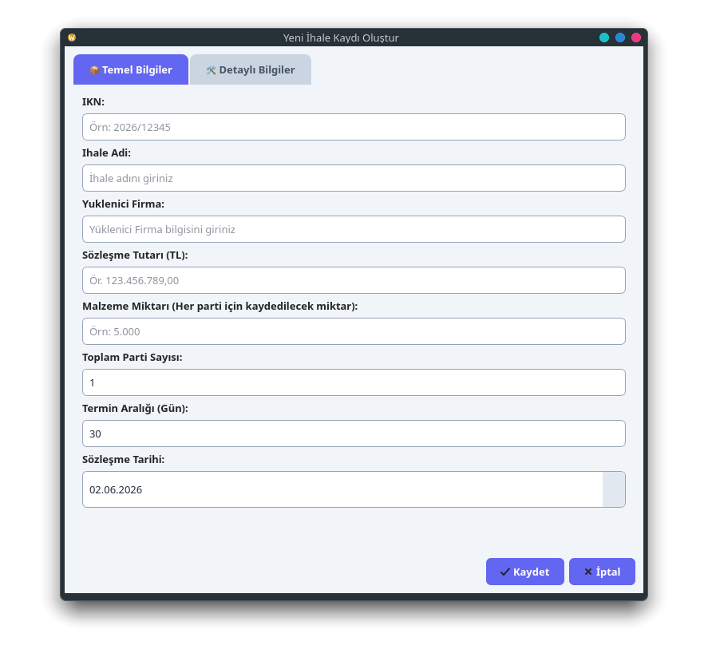
### 2. Tüm İhale ve Parti Bilgileri Sayfası

**Tüm İhale ve Parti Bilgileri** sekmesinde, Veri tabanında kayıtlı tüm bilgileri görüntüleyerek düzenleyebilirsiniz. 

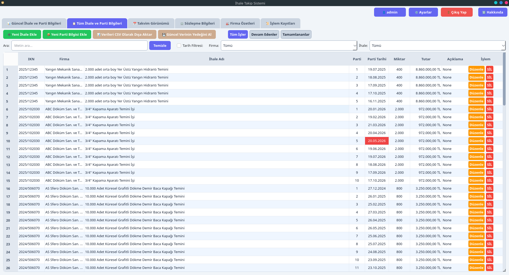

**DevamEdenler** butonuna basarak, sadece devam eden işleri filtrelemek mümkün.

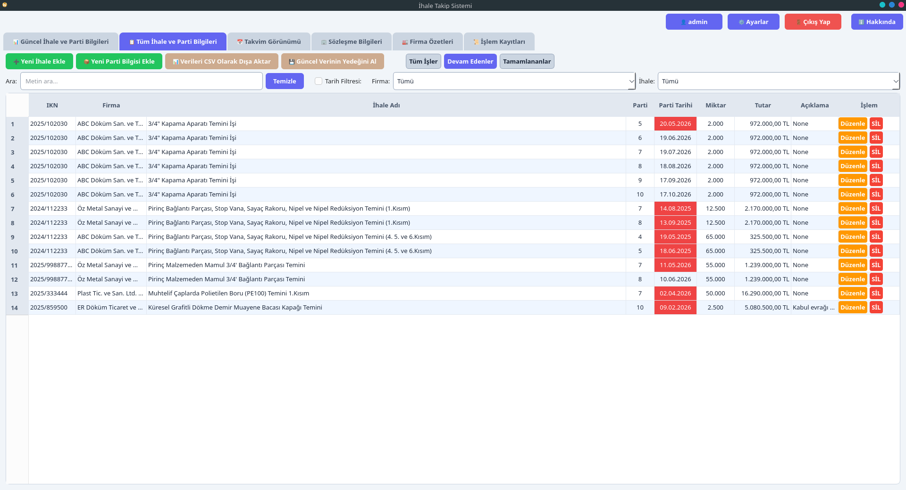

"**+ Yeni İhale Ekle**" butonuna basarak "**Yeni İhale Kaydı Oluştur**" penceresine ulaşabilir.  Gerekli bilgileri girerek yeni ihale bilgilerini veri tabanına ekleyebilirsiniz. **Temel Bilgiler** sekmesinde IKN, ihale adı, firma, sözleşme tutarı, parti sayısı ve termin aralığı gibi bilgiler girilir. **Detaylı Bilgiler** sekmesinde ise ihale türü, usulü, yaklaşık maliyet vb. ek bilgiler girilebilir.

#### Yeni İhale Kaydı Oluştur Penceresi

**Yeni İhale Kaydı Oluştur** penceresi, **Temel Bilgiler** Sekmesi;


**Yeni İhale Kaydı Oluştur** penceresi, **Detaylı Bilgiler** Sekmesi;

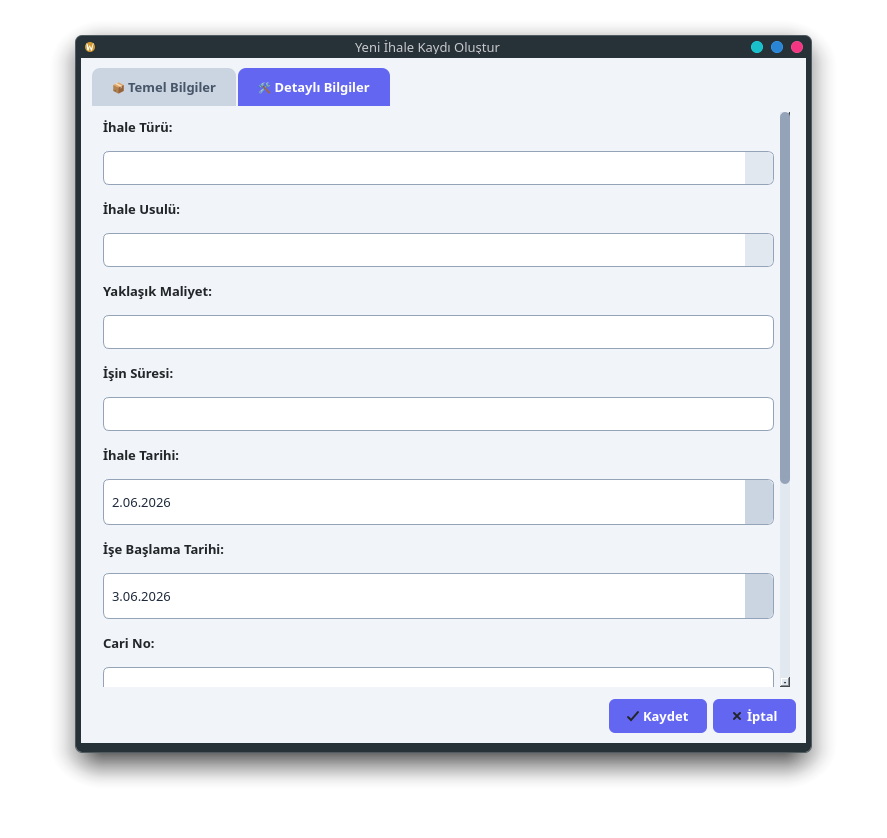
#### Yeni Parti Bilgisi Ekle Penceresi

**Tüm İhale ve Parti Bilgileri** sekmesinde bir ihale seçildikten sonra **Yeni Parti Bilgisi Ekle** butonuna tıklayarak **ilave parti bilgilerini ekleyebilirsiniz**. Seçili ihaleye ait IKN, İşin Adı, Yüklenici Firma Bilgileri otomatik olarak gelecek ve kayıtlı son partinin üzerine parti sayısı/sayıları ekleyecektir. **Eklenecek Parti Sayısı**, **Termin Aralığı (Gün)** ve **Parti Tutarı Her Parti için** bilgilerini belirtmeniz yeterli. Eklenecek parti bilgileri aşağıda önizlenecektir. Bu seçenek, yanlış girilmiş verileri düzeltmek için kullanılacağı gibi, iş artışı sonrası ilave bilgileri girmek için de kullanılabilir.

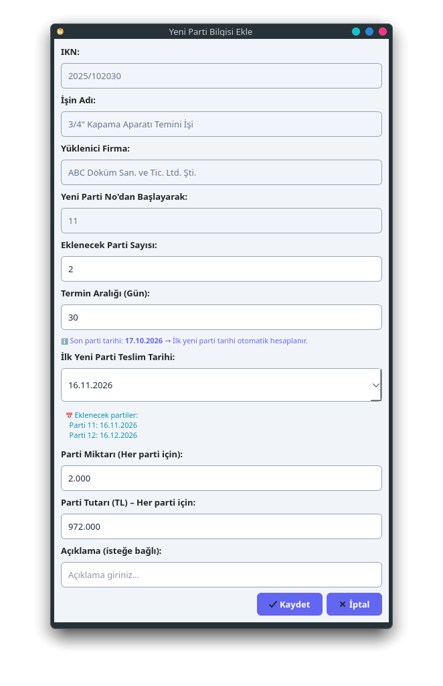

#### Kayıt Düzenle Penceresi

**Tüm İhale ve Parti Bilgileri** sekmesinde bulunan **Düzenle** butonuna basarak mevcut bilgiler düzenlenebilir / güncellenebilir. Değişiklikler kaydedildiğinde, değişikliği yapan kullanıcı ve tarih/zaman bilgisi eklenir.


Son işlem/değişiklik bilgisi, **İşlem Adımları** sekmesinde **Açıklama** kısmının üzerinde görüntülenir. 


> **NOT**:
> **Tüm İhale ve Parti Bilgileri** sekmesinde birden fazla kayıt, `CTRL` tuşu ile tek tek seçilebileceği gibi `SHIFT` tuşu yardımıyla iki seçim arası da topluca seçilebilir.

Seçime Sağ tıklanıp açılan menüden **Seçili Kayıtları Topluca Düzenle** seçeneğine basarak mevcut bilgiler toplu olarak düzenlenebilir / güncellenebilir.

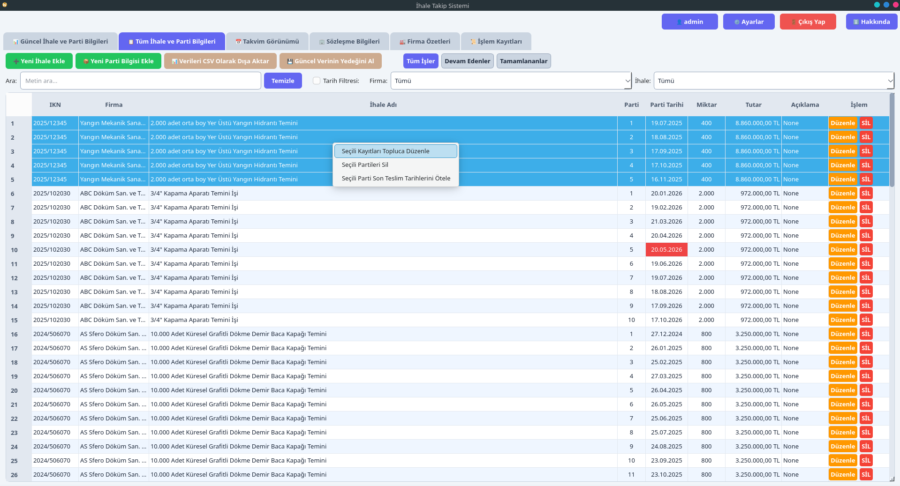

#### Toplu Kayıt Düzenle Penceresi

**Toplu Kayıt Düzenle** Penceresi **Temel Bilgiler** Sekmesi;

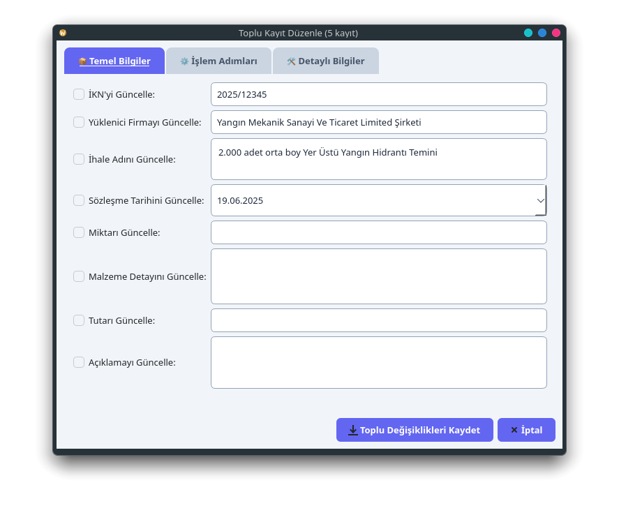

Tüm Diyalog Pencrelerinde, **Tarih Bilgisi** eklenecek girdi kısımlarının saş kısmındaki butona tıklandığında **Takvim uygulama arabirimi (widget)** açılır;

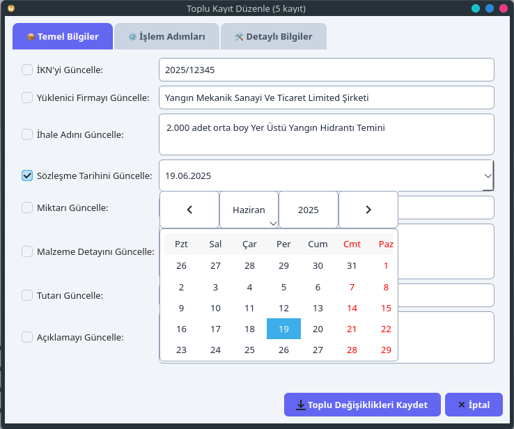

**Toplu Kayıt Düzenle** PencPenceresi **İşlem Adımları** Sekmesi;

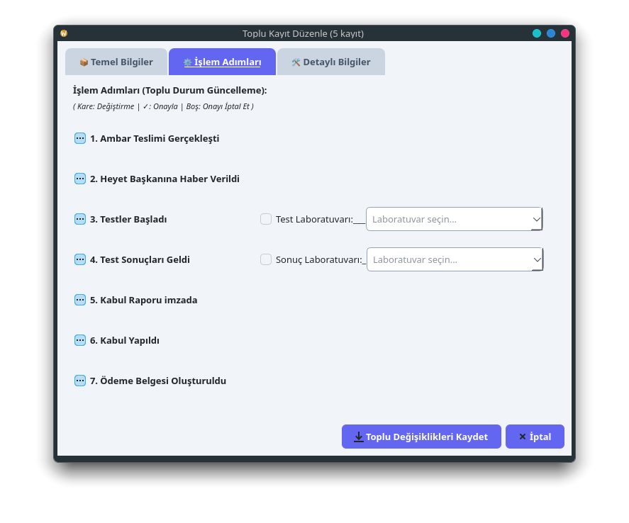

**Toplu Kayıt Düzenle** Penceresi **Detaylı Bilgiler** Sekmesi;

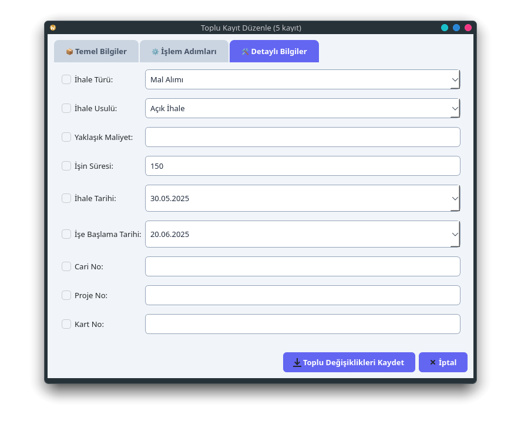

**Toplu Kayıt Düzenle** Penceresinde İhale Türü ve İhale Usulü girdileri de  **Açılır menü** aracılığı ile seçilir. İlave menü öğesi eklemek, mevcut öğeyi düzenlemek ya da mevcut menü öğelerini silmek için **Ayarlar** butonu ile ilgili bölüme ulaşmalısınız.

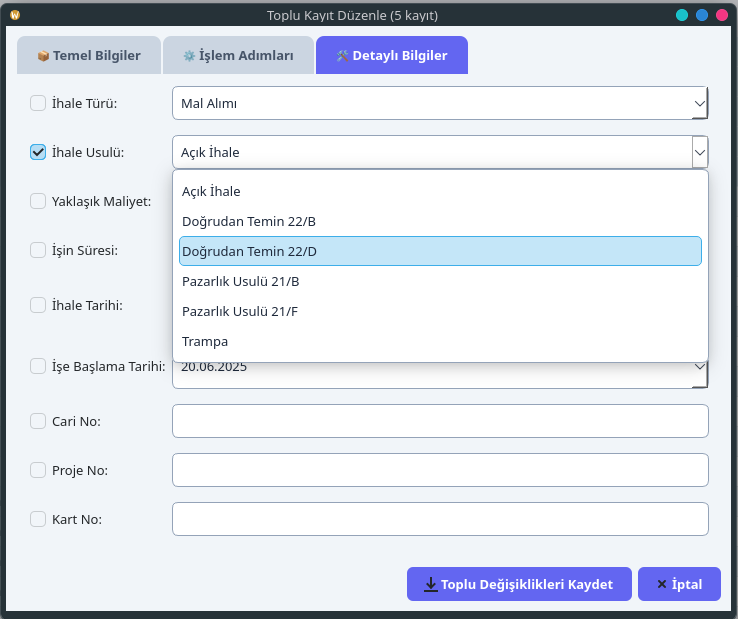


Seçime Sağ tıklanıp açılan menüden **Seçili Parti Son Teslim Tarihlerini Ötele** seçeneğine basarak mevcut Parti Son Teslim Tarihleri toplu olarak ileri ya da geri yönlü ötelenebilir. Öteleme onaylandığında gerçekleşecek Yeni Tarih bilgisi önizleme ekranında görüntülenir.

Öteleme işlemi öncesi görüntü;

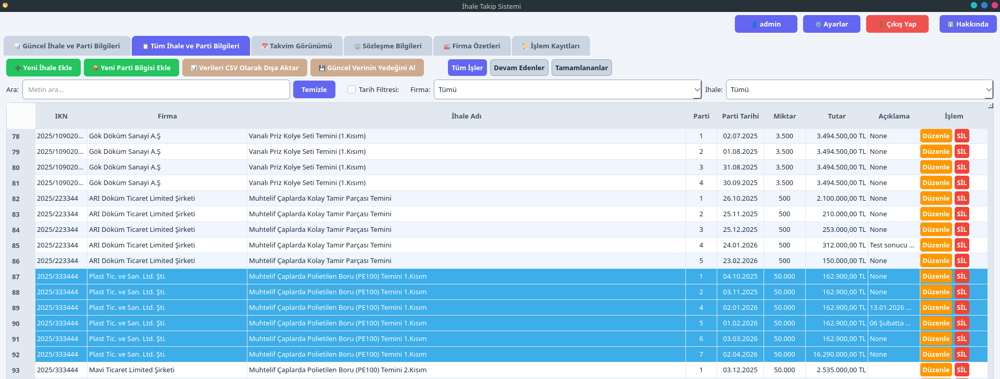

#### Tarihleri Ötele Penceresi

**Tarihleri Ötele** Penceresinde, **Ötelenecek Gün Sayısı** değiştirildiğinde, gerçekleşecek **Yeni Tarih** bilgisi ilgili sütunda önizleme olarak görüntülenir.

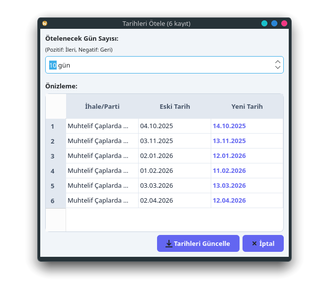

Öteleme işlemi (onayı) sonrası;

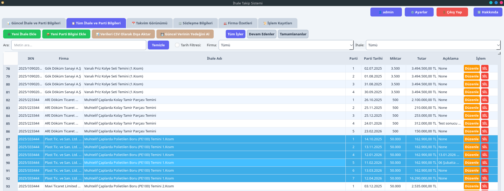

Seçime Sağ tıklanıp açılan menüden **Seçili Partileri Sil** seçeneğine basarak **Seçilen Tüm Parti bilgileri tek seferde silinebilir.**

**Tüm İhale ve Parti Bilgileri** sekmesinde de, **Arama ve Filtreleme** seçenekleri mevcut.

**Arama çubuğu**na yazılan içerikle, İhale adı, Yüklenici firma adı, IKN, ...vb bilgilere  kolaylıkla ulaşılabilir.

**Tüm İhale ve Parti Bilgileri** sekmesindeki **Sil** butonu yardımıyla, **Sadece seçili parti bilgisini** ya da **Seçili İhaleye ait tüm bilgileri** silmek mümkün.

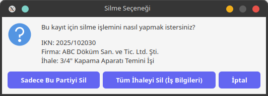

### 3. Takvim Görünümü Sayfası

**Takvim Görünümü** Sekmesinde aylık İhale ve parti bilgileri görüntülenir.

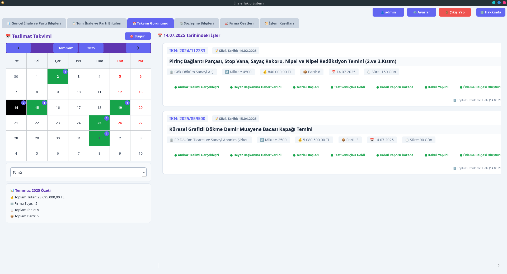

* **Siyah Renk**: Bugünü ve Takvim üzerinde yapılan seçimi,

* **Kırmızı Renk**: Henüz Ödemesi Yapılmamış parti bilgilerini,

* **Sarı Renk**: Teslim süresi yapkalan parti bilgilerini,

* **Mavi Renk**: Son teslim tarihi yaklaşmayan parti bilgilerini,

* **Yeşil Renk**: İşlemleri tamamlanmış ve Ödemesi Gerçekleşmiş parti bilgilerini

temsil eder.

Takvim üzerinde bir güne tıklandığında, seçim **siyah** renge döner ve o gün son teslim tarihi bulunan ihale detayları görüntülenir.

Takvimin alt kısmında **Aylık Toplam Tutar, Firma sayısı, Toplam İhale ve Parti bilgileri** görüntülenir. 

**Görünüm Filtresi** ile;

* Tüm Teslimatlar,

* Sadece Bekleyen,

* Sadece Tamamlanan

parti bilgileri seçilebilir.

Takvimde geriye / geçmiş aylara ya da ileriye / gelecek aylara gidilerek ihale bilgileri görüntülenebilir. **🎯 Bugün**  butonuna tıklayarak mevcut güne dönebilirsiniz. Takvim günü üzerindeki (sağ üstte) rakamlar, o gün toplam kaç adet parti bilgisini ifade eder.

### 4. Sözleşme Bilgileri Sayfası

**Sözleşme Bilgileri** Sekmesinde İhalelere ait detaylı bilgiler mevcut. Bu Sekmede;

* IKN,

* Firma Adı,

* İhale Adı,

* Toplam Sözleşme (İhale) Tutarı,

* İhaleye ait Toplam Parti Sayısı,

* Kabulü, Ödemesi yapılmamış Toplam (Kalan) Parti Sayısı

bilgileri görüntülenir.

Yukarıdaki İhale listesinden seçim yapılırsa, seçime ait Parti detayları aşağıdaki tabloda görüntülenir.

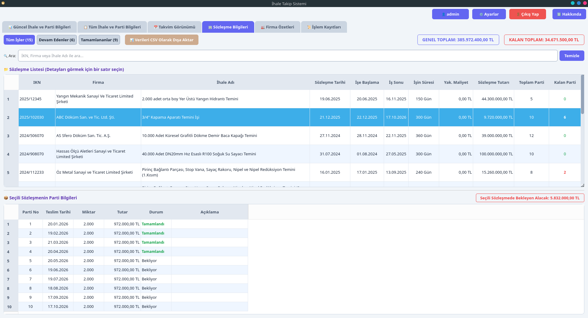

İstenirse, **Devam Edenler** Butonuna tıklanarak sadece mevcut devam eden işlere ait bilgiler filtrelenebilir. Buton üzerinde, Güncel devam eden ihale sayısı görüntülenir. 

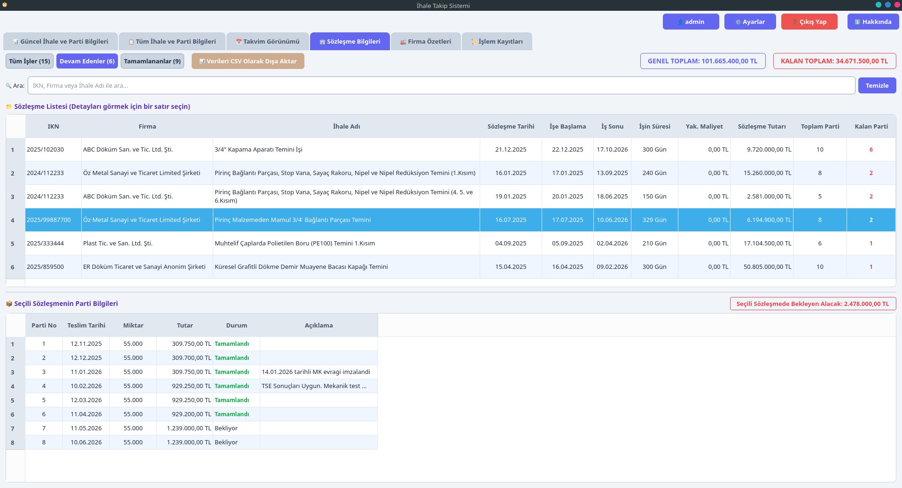

### 5. Firma Özetleri Sayfası

**Firma Özetleri** Sekmesinde, Firmaların **toplam ihale sayısı** (sözleşme imzaladığı), **toplam parti sayıları** ve bunların **toplam tutarları** görüntülenir.

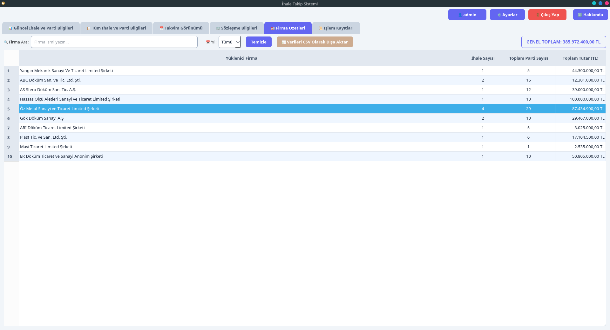

**Yıl** menüsünden seçim yapılarak o yıla ait Firma, İhale sayısı, parti sayısı ve Tutarlarını görebiliriz.

Listedeki **Yüklenici Firma isimlerinden (satırlardan) herhangi birine çift tıklanması **halinde, seçilen Yüklenici Firmaya ait işleri görüntüleyen **Firma Detayları** penceresi açılır.

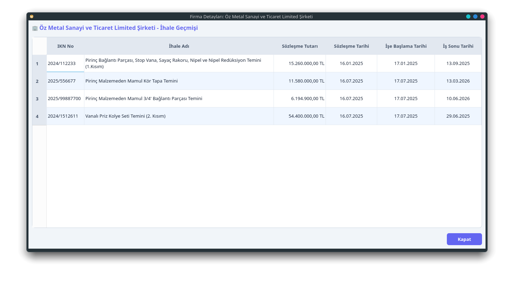
**Firma Özetleri** Sekmesinde **Arama Çubuğu**nu kullanarak filtreleme yapmak ta mümkün.

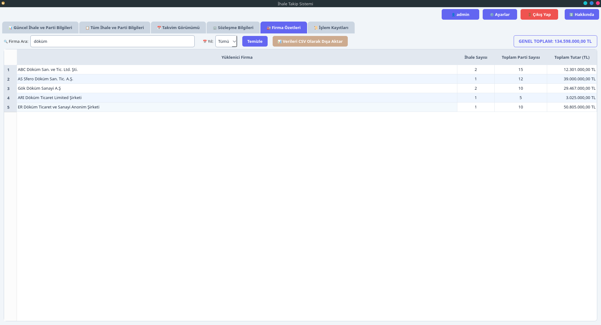

### 6. İşlem Kayıtları Sayfası

**İşlem Kayıtları** sekmesinde, kullanıcılar tarafından yapılan tüm iş kalemlerinin detaylarını görebiliriz. Bu Sekme yalnız **Admin** yetkisi olan kullanıcılara açıktır.

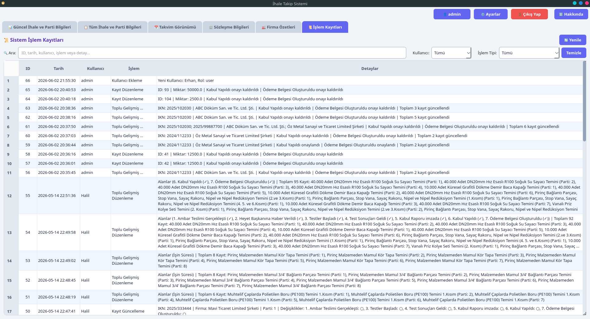

**İşlem Kayıtları** sekmesinde **İşlem Tipi**ne göre filtreleme yapılabilir;

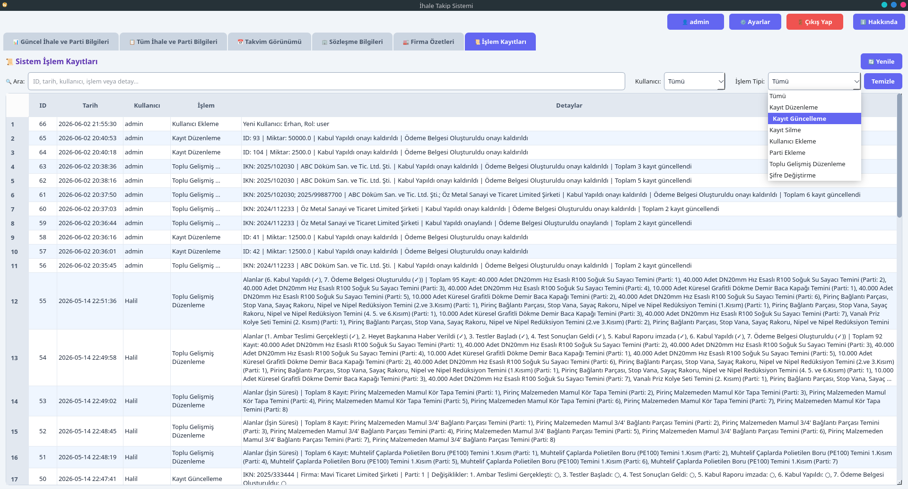

**İşlem Kayıtları** sekmesinde **Kullanıcı Adı**na göre filtreleme yapılabilir;

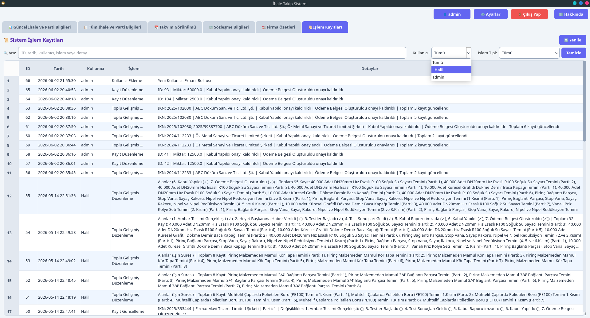

**İşlem Kayıtları** sekmesinde **Arama Çubuğu**nu kullanarak filtreleme yapmak ta mümkün.

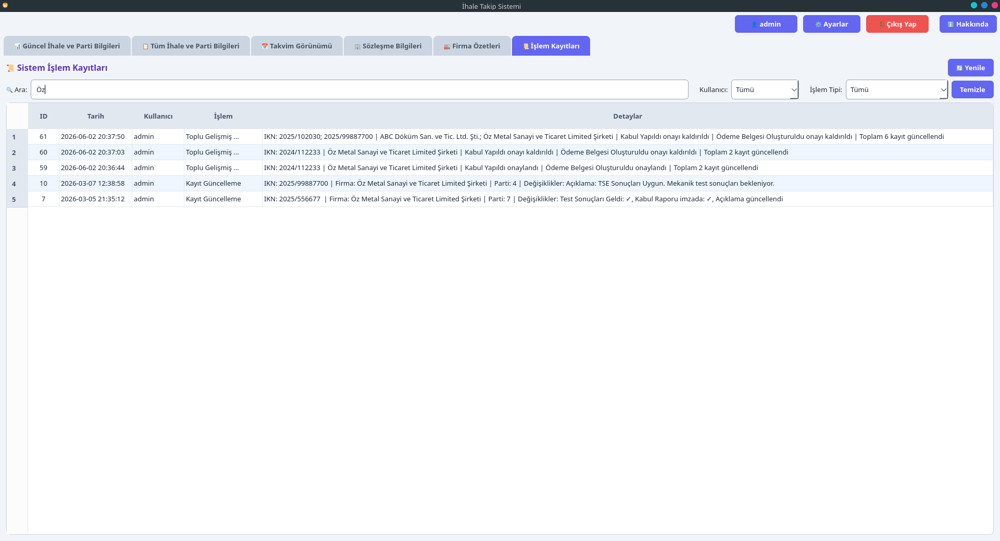

### Kullanıcı İşlemleri Penceresi

**Admin** yetkisi olan kullanıcılar, Sağ üstetki kullanıcı adı butonuna tıklayarak **Kullanıcı İşlemleri Penceresi**ni açarak;

* Şifre değişikliği,

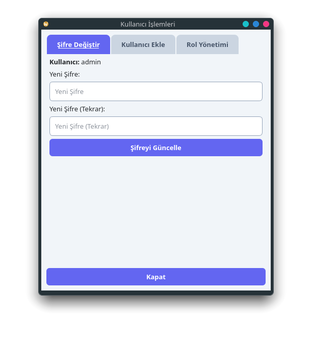,

* Kullanıcı Ekleme,

* Kullanıcı ve gruplarını görüntüleme,
 
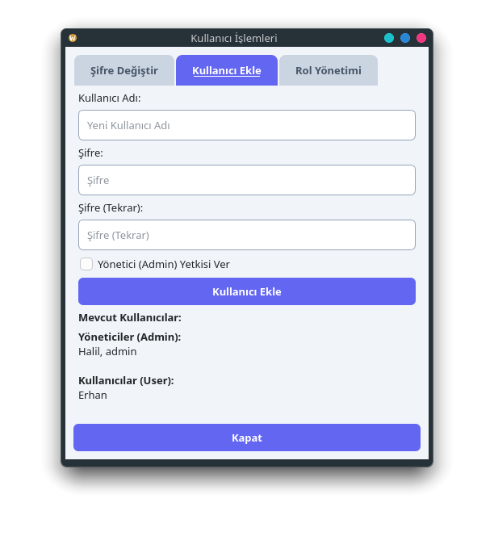

* Kullanıcı Yetkisi (Rol) değiştirme,

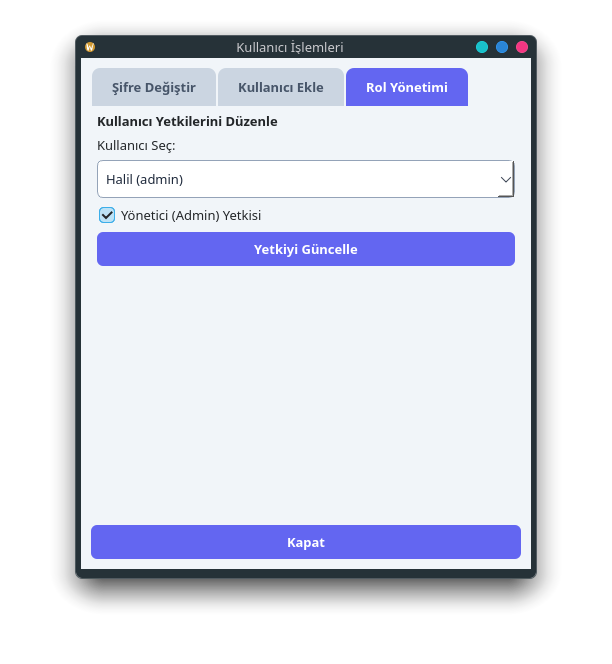

işlemleri yapabilir.

Standart kullanıcı sadece kendi şifresini değiştirebilir.

### Ayarlar Penceresi

**Ayarlar** Butonu ile açılan **Ayarlar** penceresinden;

**Tüm İhale ve Parti Bilgileri** sekmesindeki **Sütun Görünürlüğü** ayarları **Sütun Ayarları** sekmesinden değiştirilebilir.

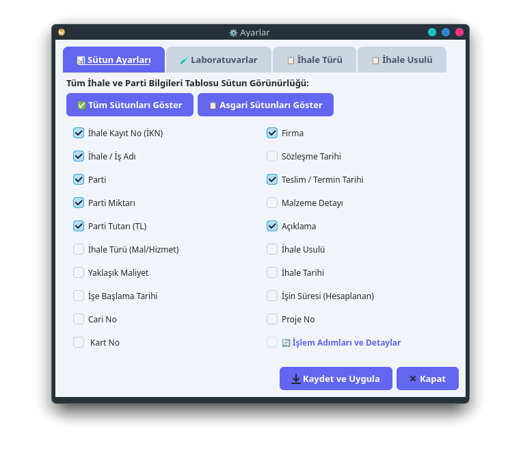

**Kayıt Düzenle, Toplu Kayıt Düzenle** ve **Hızlı Durum Güncelle** pencerelerindeki açılır menülerde görüntülenen Laboratuvar isimleri, **Laboratuvarlar** sekmesinden yönetilebilir. (Test laboratuvarlarını ekleme/düzenleme/silme)

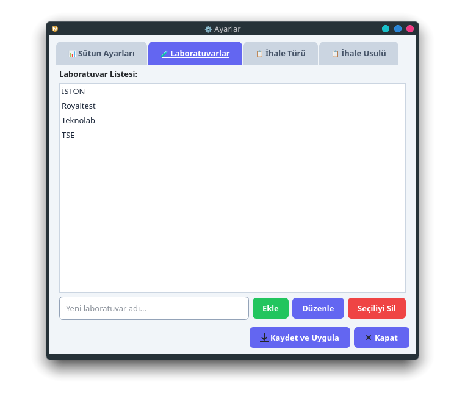

**Toplu Kayıt Düzenle** penceresindeki açılır menülerde görüntülenen İhale Türü Bilgisi, **İhale Türü** sekmesinden yönetilebilir.

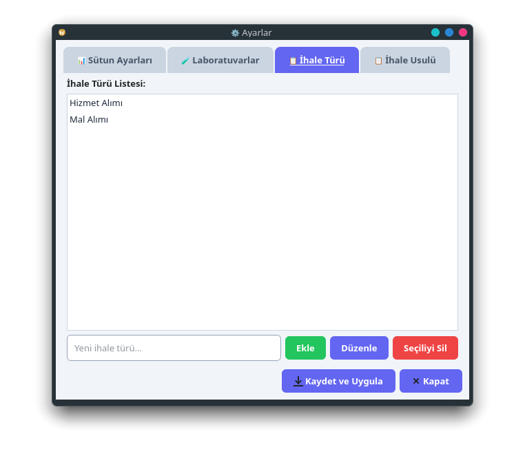

**Toplu Kayıt Düzenle** penceresindeki açılır menülerde görüntülenen İhale Usulü Bilgisi, **İhale Usulü** sekmesinden yönetilebilir.

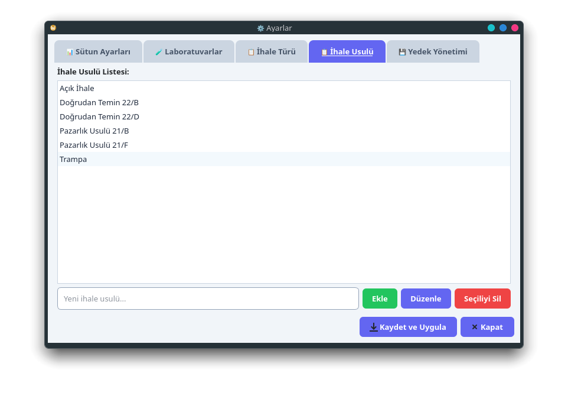

### Hakkında Penceresi

Uygulama sürüm bilgisi, geliştirici ve teknik detaylar.

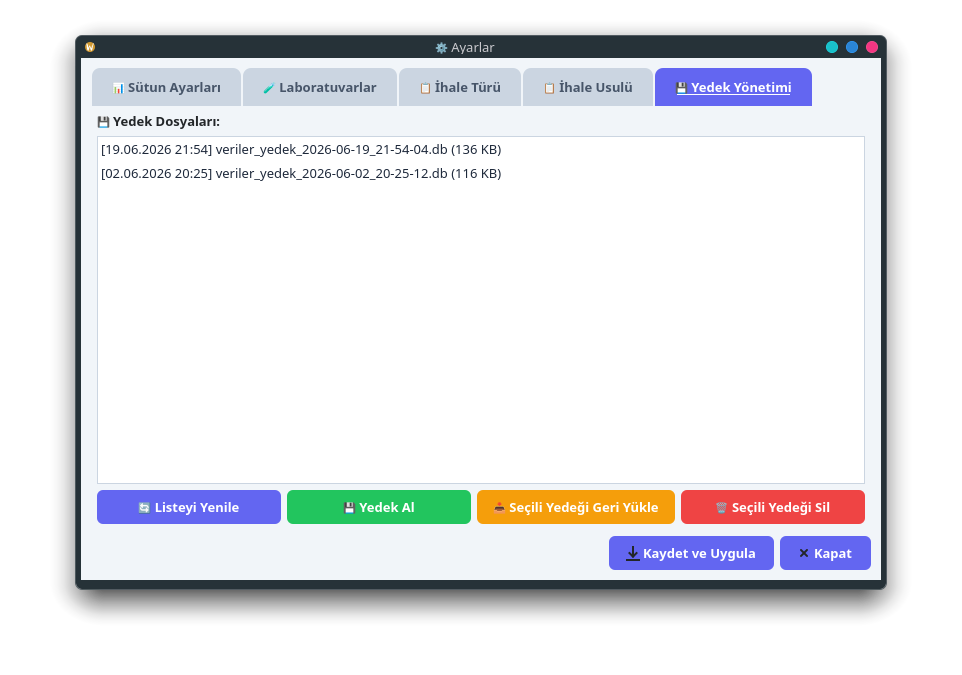

## 👨‍💻 Geliştirici ve Destek

- **Geliştirici:** Mustafa Halil GÖRENTAŞ
- **Kaynak Kod / İletişim:** [GitHub - mhalil](https://github.com/mhalil/ihale_takip_sistemi)
- **Lisans:** GPL (Genel Kamu Lisansı)

**Teknik Bilgiler:**

* Platform: Google Antigravity ve OpenCode
* Metodoloji: Vibe Coding
* Progrmalama Dili: Python 3.12.4
* Framework: PyQt6 (Riverbank Computing)
* Veri Tabanı: SQLite

GPL Lisansı Altında Dağıtılmaktadır. | 2026
